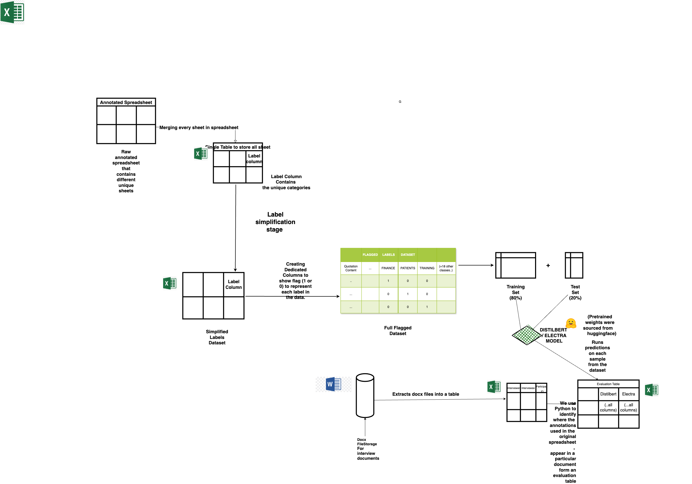

# pytranscripts
An Open source👨‍🔧 Python Library for Automated classification of Electronic Medical records 

## Installation
To install , simply use

```sh
pip install pytranscripts
```

## Pipeline Summary


### Stages
1. Data Extraction
2. Target Identification
3. Finetuning Annotated Data on Pretrained models (Bert & Electra)
4. Extracting Interviwer/Interviewee records from the specified docx file storage
5. Metrics Evaluation (Accuracy & Cohen Kappa Score)
6. Reordering records as a neatly arranged and flagged spreadsheet, alongside metrics and reports from pretrained models.

## Example Usage

#### Generating the Survey Dataset
```python
#extract the survey information from docx file storage

from pytranscripts import docx_transcripts_to_excel

input_directory = "Docx_Records_folder"
output_file = "SURVEY_TABLE.xlsx"

docx_transcripts_to_excel(input_directory,output_file)
```

#### Training the model

```python
from pytranscripts import NLPModelTrainer

# Initialize the trainer with paths to your datasets and drive
trainer = NLPModelTrainer(
    base_path="/path/to/basedir", # base directory
    refined_data_path="/path/to/Refined_targets.xlsx", # path to refined human annotations
    survey_data_path="/path/to/SURVEY_TABLE.xlsx", # path to the survey data from extracted documents
)

# Train both BERT and Electra models
trainer.train_models(bert=True, electra=True)

# Classify a piece of text using the trained BERT model
result = trainer.classify_text("This is a sample interview response.", "bert")
print(result)

# Generate encoded evaluation files for human annotations, BERT, and Electra
trainer.generate_encoded_evaluation_files()

```

## Deps
- Python 3.12
- Transformers
- Pytorch

